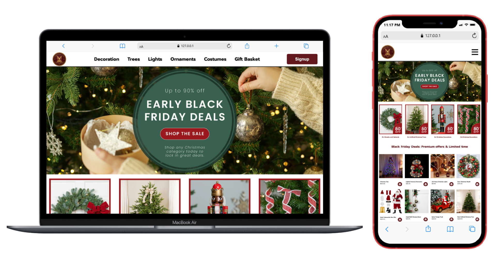

<p align="center">
  
</p>

# Christmas Luxe – Christmas shop UI

This project is a **premium Christmas shop UI** built with **HTML** and **CSS**
It offers a **modern and responsive interface** for browsing holiday products, viewing discounts, and exploring festive deals.

---

## 📸 Preview



---

## 🔗 Live Demo

<p align="center">
  <a href="https://anujghimire08.github.io/Christmas-Luxe/">
   
  </a>
</p>

The UI contains:

- A sticky **header** with logo, navigation menu, and signup button
- **Banner images** for sales and promotions
- **Discount cards** highlighting ongoing offers
- **Product cards** displaying items with image, title, price, and add-to-cart button
- Fully **responsive layout** for mobile and desktop
- Footer with **organization details**, **customer service links**, and **payment options**
- Hover effects for products and interactive buttons

---

## 🛠️ Technologies Used

- **HTML5** – Structure and layout
- **CSS3** – Modern styling, hover effects, responsive design
- **Remix Icons** – For cart and menu icons
- **Google Fonts** – Typography

---

## 📁 Project Structure

```
ChristmasLuxe-Shop-UI/
│── index.html
│── style.css
│── images
```
